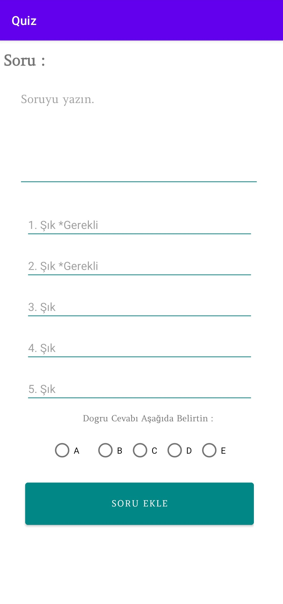
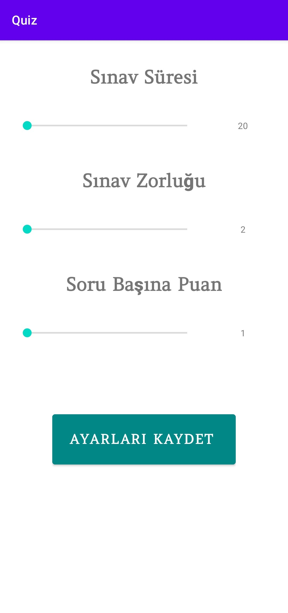

# Quiz Application - My First Mobile App
Mobile application that created in Android allows you set,edit and reset quiz modules.

## Project Screenshots
- Sign In & Sign Up page.

 

- Main Page.

- Page for adding question into the planned quiz.

- Pages before starting the quiz that allows edit settings of the quiz & questions.

 
